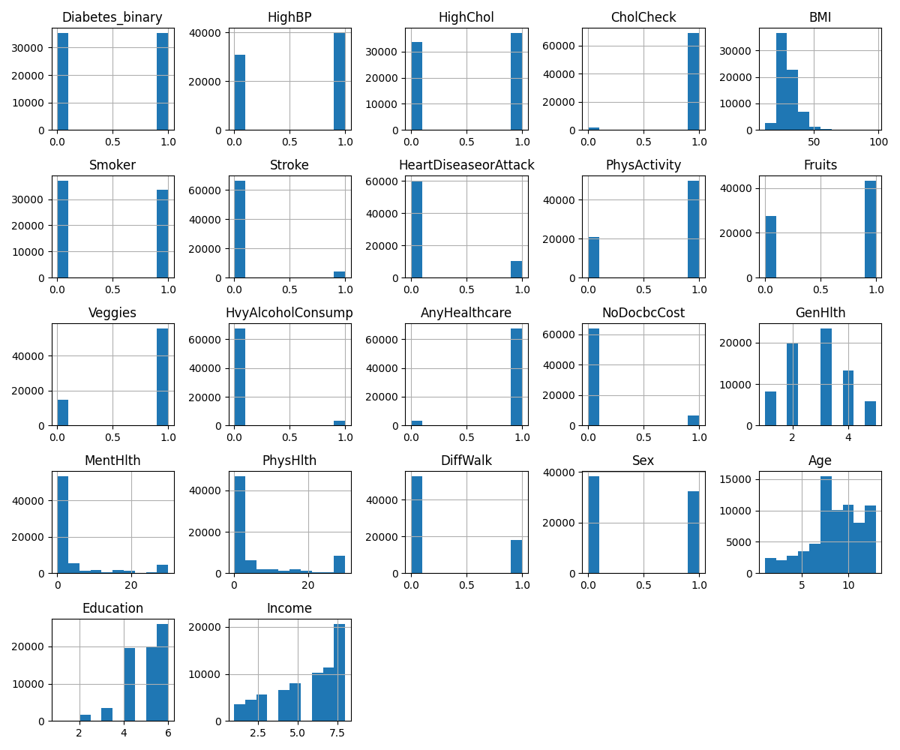
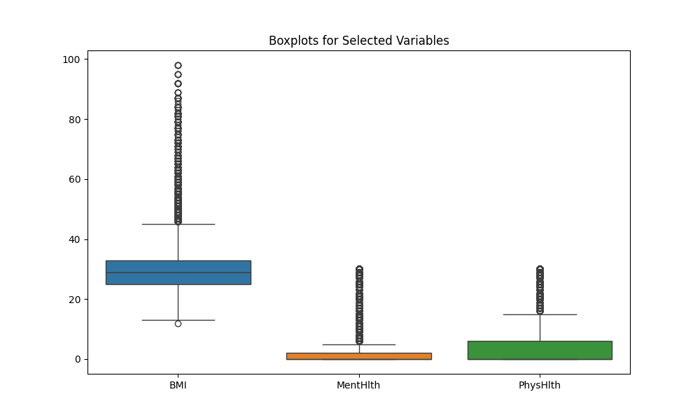
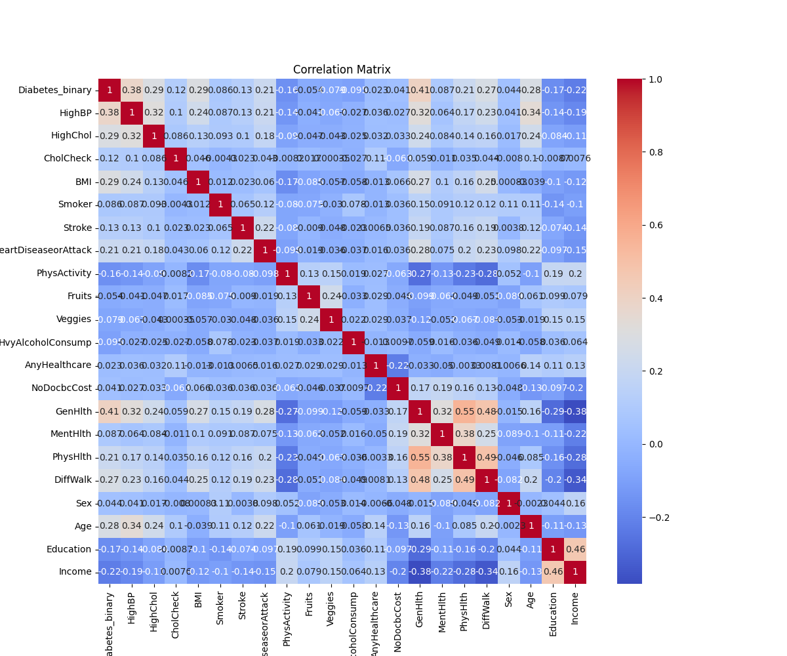

# Diabetes Health Indicators Project

## 📋 Opis projektu
Celem tego projektu jest stworzenie modelu predykcyjnego, który przewiduje ryzyko wystąpienia cukrzycy u pacjentów na podstawie wskaźników zdrowotnych. Projekt ten analizuje wskaźniki zdrowotne, które mogą mieć wpływ na rozwój cukrzycy, co może wspierać profilaktykę i wczesne wykrywanie choroby oraz pomoc w podejmowaniu decyzji medycznych.

## 📊 Dane
### Diabetes Health Indicators Dataset
- **Źródło danych**: [Kaggle - Diabetes Health Indicators Dataset](https://www.kaggle.com/datasets/alexteboul/diabetes-health-indicators-dataset)
- **Liczba rekordów**: Ponad 250,000 rekordów
- **Atrybuty**:
  - Zmienna docelowa (`diabetes_binary`): 1 – pacjent choruje na cukrzycę, 0 – pacjent nie choruje.
  - Inne wskaźniki zdrowotne, m.in.:
    - **BMI**: Wskaźnik masy ciała.
    - **Ciśnienie krwi**: Wartość skurczowa i rozkurczowa.
    - **Poziom cholesterolu**: Cholesterol całkowity i HDL.
    - **Aktywność fizyczna**: Poziom aktywności fizycznej.
    - **Palenie papierosów**: Informacja, czy pacjent pali papierosy.
    - **Inne czynniki ryzyka**: Wiek, płeć i inne.

## 🎯 Cele projektu
1. **Eksploracja i analiza danych**: Zrozumienie rozkładu wskaźników zdrowotnych i ich związku z ryzykiem cukrzycy.
2. **Trenowanie modelu**: Zbudowanie i optymalizacja modelu predykcyjnego do klasyfikacji ryzyka cukrzycy.
3. **Walidacja i testowanie**: Ewaluacja skuteczności modelu na zbiorze testowym.
4. **Publikacja i wdrożenie**: Przygotowanie modelu do wdrożenia jako API, z możliwością dalszego doszkalania na nowych danych.

## 📐 Podział danych
- **Trenowanie modelu**: 70% danych (używane do początkowego trenowania modelu).
- **Doszkalanie modelu**: 30% danych (zachowane do dalszego doszkalania).
  
Dane zostaną podzielone za pomocą skryptu `src/data_cleaning.py`, który automatycznie zapisze zbiory w katalogu `data/`.

## 📚 Instrukcja użycia

### 1. Pobranie danych
Pobierz dane z Kaggle i zapisz je w folderze `data/raw/` jako `diabetes_health_indicators.csv`.

### 2. Przygotowanie środowiska
Zainstaluj wymagane biblioteki za pomocą poniższego polecenia:
```bash
pip install -r requirements.txt
```

### 3. Podział danych
Uruchom skrypt `src/data_cleaning.py`, aby podzielić dane na zbiory trenowania i doszkalania:
```bash
python src/data_cleaning.py
```

### 4. Analiza danych i trenowanie modelu
Przeprowadź analizę i trenuj model, otwierając notebooki w katalogu `notebooks/`:
- `exploratory_data_analysis.ipynb`: Analiza eksploracyjna wskaźników zdrowotnych.
- `model_training.ipynb`: Notebook z trenowaniem i oceną modelu predykcyjnego.

## 📋 Wymagania systemowe
- Python 3.x
- Pakiety: `pandas`, `scikit-learn`, `matplotlib`, `seaborn`, `numpy`


### 🔍 Automatyczna analiza modeli (AutoML)

Do automatycznego doboru modelu wykorzystano bibliotekę **TPOT**, która przetestowała wiele modeli klasyfikacyjnych i ich hiperparametry.

- Najlepszy model: **GradientBoostingClassifier**
- Parametry: 
  - `max_depth=6`
  - `min_samples_leaf=17`
  - `subsample=0.55`
  - `learning_rate=0.1`

### 📊 Wyniki ewaluacji modelu

Model został przetestowany na zbiorze testowym (30% danych). Oto podstawowe metryki:

- **Dokładność (Accuracy):** 0.7558
- **Precyzja (Precision):**
  - Klasa 0 (brak cukrzycy): 0.78
  - Klasa 1 (cukrzyca): 0.73
- **Recall:**
  - Klasa 0: 0.71
  - Klasa 1: 0.80
- **F1-Score:**
  - Klasa 0: 0.74
  - Klasa 1: 0.77
- **Wsparcie (Support):**
  - Klasa 0: 10601
  - Klasa 1: 10607

Szczegółowe wyniki zapisano w pliku [metrics.json](reports/metrics.json).

### 📈 Wizualizacje danych

W ramach analizy eksploracyjnej danych wygenerowano następujące wizualizacje:

1. **Histogramy zmiennych numerycznych**  
   

2. **Wykresy pudełkowe dla wybranych zmiennych**  
   

3. **Macierz korelacji**  
   

### 🌐 Raport z analizy eksploracyjnej
Dodatkowo, automatyczny raport z eksploracyjnej analizy danych został wygenerowany za pomocą **Sweetviz** i zapisany jako interaktywny HTML. Możesz go otworzyć w przeglądarce, klikając poniższy link:

👉 [Raport Sweetviz](reports/sweetviz_report.html)
