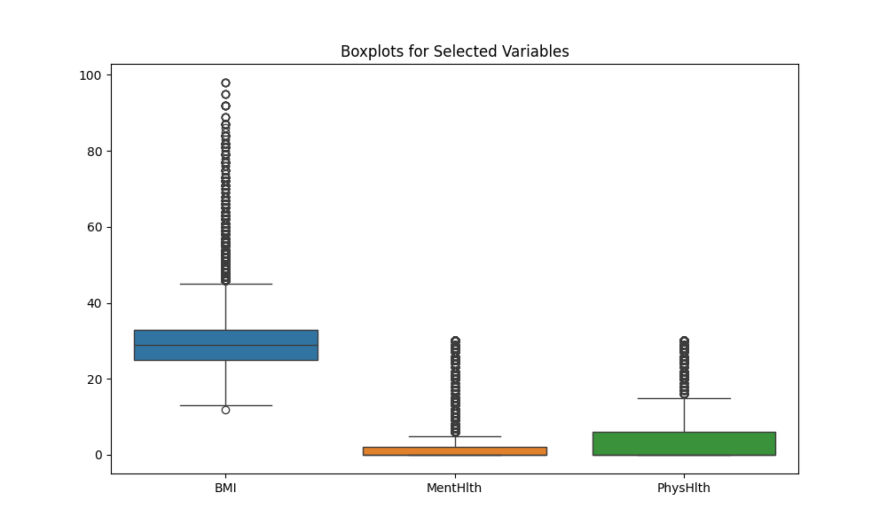

### Automatyczna analiza modeli (AutoML)

#### Wybrane narzędzie
Do automatycznego doboru modelu wykorzystano bibliotekę **TPOT**, która przetestowała wiele modeli klasyfikacyjnych i ich hiperparametry.

#### Najlepszy model wybrany przez TPOT
- **Model:** GradientBoostingClassifier
- **Parametry:**
  - `max_depth=6`
  - `min_samples_leaf=17`
  - `subsample=0.55`
  - `learning_rate=0.1`

#### Wyniki ewaluacji modelu
Model został przetestowany na zbiorze testowym (30% danych). Oto podstawowe metryki:

- **Dokładność (Accuracy):** 0.7558
- **Precyzja (Precision):**
  - Klasa 0 (brak cukrzycy): 0.78
  - Klasa 1 (cukrzyca): 0.73
- **Recall:**
  - Klasa 0: 0.71
  - Klasa 1: 0.80
- **F1-Score:**
  - Klasa 0: 0.74
  - Klasa 1: 0.77
- **Wsparcie (Support):**
  - Klasa 0: 10601
  - Klasa 1: 10607

Szczegółowe wyniki zostały zapisane w pliku [metrics.json](metrics.json).

---

### Wizualizacje i raporty

#### Wygenerowane wizualizacje
- 
- 
- 

#### Automatyczny raport
- Pełny raport z analizy danych dostępny w formacie HTML: [Raport Sweetviz](sweetviz_report.html)

---

### Kierunki dalszego rozwoju projektu

#### Hiperoptymalizacja modelu
- Wykorzystanie narzędzi takich jak Grid Search lub Bayesian Optimization do dalszej optymalizacji parametrów modelu.

#### Porównanie modeli
- Przetestowanie alternatywnych algorytmów (np. RandomForest, XGBoost) i porównanie ich wyników z GradientBoostingClassifier.

#### Rozszerzenie zbioru danych
- Rozważenie wzbogacenia zbioru danych o nowe cechy, takie jak genetyczne predyspozycje lub dane socjoekonomiczne, aby poprawić jakość prognozowania.

#### Monitorowanie modelu
- Przygotowanie pipeline'u do monitorowania wydajności modelu na nowych danych oraz re-trenowania w przypadku degradacji jakości wyników.

---

### Podsumowanie
Model GradientBoostingClassifier zapewnia solidne wyniki z dokładnością 0.7558 i zrównoważonymi metrykami precyzji i recall. Istnieje jednak potencjał do dalszej poprawy poprzez optymalizację parametrów i wdrożenie modelu w środowisku produkcyjnym.

